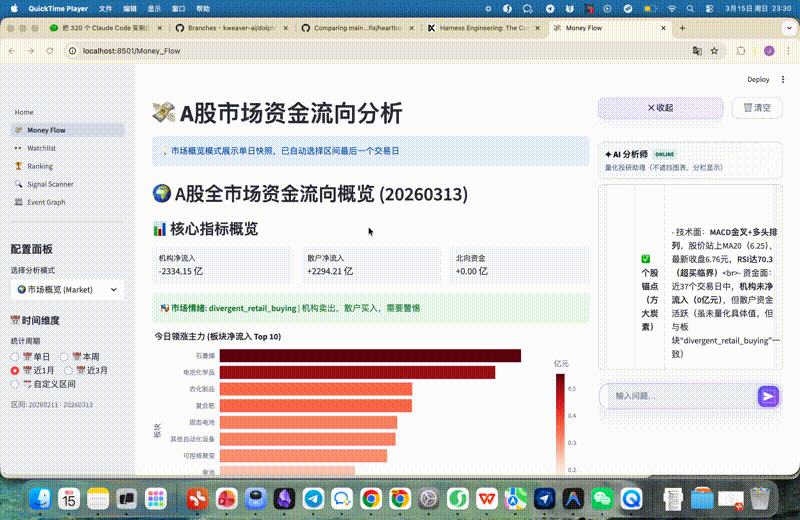

# 量化交易系统 (Quantitative Trading System)

**🎉 新架构重构完成！统一、清晰、易维护的量化交易系统**

基于多数据源的量化交易策略回测和投资分析系统，采用全新统一架构，整合交易策略、投资分析、新闻事件概率图于一体。



> [点击查看完整演示视频](docs/assets/demo.mp4)

## 🖥️ Web 可视化平台

系统提供基于 Streamlit 的 Web 可视化平台，5 个功能页面覆盖日常投研全流程：

| 页面 | 功能 |
|------|------|
| 💰 资金流向 | 行业 / 个股主力资金实时分析，多维度热力图与评分 |
| 📋 自选股 | 持仓监控、个股技术面与资金面快速对比 |
| 🏆 风向排行榜 | 多因子智能排名，支持短线 / 价值 / 趋势等多种策略 |
| 🔍 信号扫描 | 宏观流动性、箱体突破、价值挖掘等多模式信号扫描 |
| 📰 新闻事件概率图 | 输入新闻 → 结构化事件 → 因果路径 → Bull/Base/Bear 概率 → 受益受损资产 |

### 启动 Web 平台

```bash
# 启动（后台运行）
./scripts/run_web.sh start

# 查看状态
./scripts/run_web.sh status

# 停止
./scripts/run_web.sh stop
```

启动后访问 http://localhost:8501

## 🆕 新架构特性

### ✨ 统一CLI入口
- **单一命令入口**: `python -m quant <command> <subcommand>` 解决所有需求
- **快捷方式**: `bin/` 目录下的脚本作为便捷快捷方式
- **模块化功能**: etf/portfolio/advisor/strategy/system 五大功能模块
- **向后兼容**: 旧脚本自动转换为新CLI调用

### 🏗️ 清晰架构层次
- **Core Layer**: 基础设施 (`quant/core/`)
- **Data Layer**: 数据处理 (`quant/data/`)
- **Strategy Layer**: 策略实现 (`quant/strategies/`)
- **Analysis Layer**: 分析工具 (`quant/analysis/`)
- **Knowledge Layer**: 事件知识图谱 (`quant/knowledge/`)
- **Web Layer**: Streamlit 可视化平台 (`web/`)
- **CLI Layer**: 命令行接口 (`quant/cli/` + `quant/__main__.py`)

### 📦 统一导入体验
```python
from quant import (
    get_config,              # 统一配置管理
    create_data_provider,    # 统一数据源
    PortfolioAnalyzer,       # 投资组合分析
    InvestmentAdvisor,       # 投资顾问
    BacktestEngine,          # 回测引擎
    STRATEGY_REGISTRY        # 策略注册表
)
```

## 🚀 快速开始

### 1. 安装依赖

**推荐使用 uv（更快）**:
```bash
# 安装 uv（如果还没有）
curl -LsSf https://astral.sh/uv/install.sh | sh

# 同步依赖（自动创建虚拟环境）
uv sync

# 运行命令
uv run python -m quant system status
```

**或者使用 pip（传统方式）**:
```bash
python -m venv venv
source venv/bin/activate  # Windows: venv\Scripts\activate
pip install -r requirements.txt
```

### 2. 环境配置
```bash
cp env_example_unified.txt .env
# 编辑 .env 文件配置 API keys
```

### 3. 系统检查
```bash
# 使用 uv
uv run python -m quant system status

# 或使用已激活的 venv
python -m quant system status
```

## 📋 五大核心模块详解

系统提供5个核心功能模块，每个模块专注于特定的量化分析场景：

### 1️⃣ ETF 筛选与估值模块 (`etf`)

**核心功能**：
- 动量筛选：基于多周期收益率、RSI、MACD等技术指标
- 估值分析：价格历史分位数、均值回归、估值区间判断
- 智能评分：结合动量和估值的综合评分系统（高估降分、低估加分）

**适用场景**：
- 从大量ETF中筛选优质投资标的
- 判断ETF当前是高估还是低估
- 寻找均值回归的投资机会
- 构建ETF投资组合

**主要命令**：
```bash
# 筛选宽基ETF（包含估值分析）
python -m quant etf screen --types broad_market --save

# 从配置篮子筛选（如行业ETF）
python -m quant etf screen --from-config INDUSTRY_ETF --save

# 分析单只ETF的动量和估值
python -m quant etf single 510300.SH

# 查看筛选配置和可用ETF篮子
python -m quant etf config --show
python -m quant etf config --list
```

**输出内容**：
- CSV数据：包含动量指标、估值分位数、综合评分等
- Markdown报告：详细的估值分析、分位数分布、均值回归信号
- 估值等级：7个等级（极度低估→极度高估）
- 投资建议：基于估值和动量的综合建议

**特色功能**：
- ✅ 价格历史分位数分析（1年/2年/3年多周期）
- ✅ 均值回归信号生成（基于布林带）
- ✅ 估值调整评分（避免追涨杀跌）
- ✅ 支持从配置文件批量筛选

---

### 2️⃣ 投资组合分析模块 (`portfolio`)

**核心功能**：
- Sleeve分层管理：支持现金/债券/防守/进攻四层结构
- 权重再平衡：基于目标权重的再平衡建议
- 风险评估：多维度风险指标和评级
- 收益归因：分析收益来源和偏差

**适用场景**：
- 分析真实持仓组合的表现
- 获得专业的组合再平衡建议
- 评估组合风险和分散度
- 监控组合与预期目标的偏差

**主要命令**：
```bash
# 分析已配置的投资组合
python -m quant portfolio analyze USER_REAL_PORTFOLIO

# 列出所有可用组合
python -m quant portfolio list
```

**输出内容**：
- 组合概况：总价值、持仓数量、资产类别分布
- Sleeve分析：各层实际权重 vs 目标权重
- 收益表现：总收益、年化收益、超额收益
- 风险评估：最大回撤、夏普比率、风险评级
- 再平衡建议：需要调整的标的和金额

**真实案例**：
```
投资组合分析: USER_REAL_PORTFOLIO
  组合价值: 169.5万元
  实际收益: +21.99%
  预期收益: +16.17%
  超额收益: +5.81%
  风险评级: ⭐⭐⭐⭐⭐ (优秀)
  持仓标的: 20个
  资产类别: 18个
```

---

### 3️⃣ 投资顾问模块 (`advisor`)

**核心功能**：
- 单标的深度分析：技术面 + 基本面综合评估
- 策略适配评估：自动匹配最适合的交易策略
- 综合分析：包含策略回测的完整分析
- 投资建议生成：买入/持有/卖出建议

**适用场景**：
- 深入了解某个股票/ETF的投资价值
- 选择最适合的交易策略
- 获得基于量化分析的投资建议
- 评估标的的风险收益特征

**主要命令**：
```bash
# 单标的深度分析（技术面+策略适配）
python -m quant advisor single 002594.SZ

# 综合分析（包含策略回测）
python -m quant advisor comprehensive 002594.SZ
```

**输出内容**：
- 技术指标：RSI、MACD、移动平均线、成交量分析
- 策略评估：MA交叉、动量策略、网格交易适用性
- 风险等级：综合风险评分和等级
- 投资建议：明确的操作建议和理由
- 历史表现：近期收益率、波动率、回撤

**分析维度**：
- 📊 技术面分析：20+ 技术指标
- 📈 趋势判断：多周期均线系统
- 💹 动量评估：RSI、MACD、资金流向
- 🎯 策略匹配：3种主流策略适配度
- ⚠️ 风险评估：波动率、回撤、风险等级

---

### 4️⃣ 策略回测模块 (`strategy`)

**核心功能**：
- 多策略支持：MA交叉、动量、网格交易等
- 历史回测：基于真实历史数据的模拟交易
- 性能评估：多维度性能指标计算
- 参数优化：自动寻找最优策略参数

**适用场景**：
- 验证交易策略的有效性
- 比较不同策略的表现
- 优化策略参数
- 评估策略风险收益特征

**主要命令**：
```bash
# 回测移动平均交叉策略
python -m quant strategy backtest ma_crossover 002594.SZ

# 回测动量策略
python -m quant strategy backtest momentum 002594.SZ

# 回测网格交易策略
python -m quant strategy backtest unified_grid 000001.SZ

# 列出所有可用策略
python -m quant strategy list
```

**支持的策略**：
1. **MA Crossover（均线交叉）**
   - 适用：趋势市场
   - 信号：金叉买入、死叉卖出
   - 参数：短期/长期均线周期

2. **Momentum（动量策略）**
   - 适用：强势股票、突破行情
   - 信号：RSI、MACD、价格动量
   - 特点：动态止损、分批建仓

3. **Unified Grid（统一网格）**
   - 适用：震荡市场
   - 策略：低买高卖、区间套利
   - 优化：自动网格间距和层数

**回测输出**：
```
策略回测结果: ma_crossover
标的: 002594.SZ
时间: 20240101 - 20241201

性能指标:
  总收益率: +15.30%
  年化收益: +18.45%
  最大回撤: -8.20%
  夏普比率: 1.85
  胜率: 58.3%
  交易次数: 12次
```

---

### 5️⃣ 系统管理模块 (`system`)

**核心功能**：
- 系统状态检查：环境、配置、数据源健康度
- 缓存管理：清理过期或无用的缓存数据
- 版本信息：查看系统版本和组件版本
- 配置验证：检查配置文件完整性

**适用场景**：
- 首次安装后的系统检查
- 定期清理缓存释放空间
- 排查系统配置问题
- 查看系统运行状态

**主要命令**：
```bash
# 系统状态全面检查
python -m quant system status

# 清理所有缓存
python -m quant system clean --type all

# 清理特定类型缓存
python -m quant system clean --type etf
python -m quant system clean --type data

# 查看版本信息
python -m quant system version
```

**状态检查内容**：
```
系统状态检查报告:

📦 版本信息:
  量化系统版本: 2.0.0
  Python版本: 3.9+

🔐 环境配置:
  TUSHARE_TOKEN: ✅ 已设置
  数据源: Tushare (主) + Yahoo Finance (备用)

📁 目录状态:
  data/      ✅ 存在
  cache/     ✅ 存在
  logs/      ✅ 存在
  reports/   ✅ 存在
  config/    ✅ 存在

⚙️ 配置文件:
  config.yaml              ✅ 有效
  config/portfolios.yaml   ✅ 有效
  config/screens.yaml      ✅ 有效
```

**缓存管理**：
- 数据缓存：Tushare、Yahoo Finance缓存的历史数据
- 分析缓存：ETF筛选、组合分析等结果缓存
- 报告文件：生成的Markdown、CSV报告
- 日志文件：系统运行日志

---

### 6️⃣ 新闻事件概率图模块 (`event_investment`)

**核心功能**：
- 新闻解析：将自由文本新闻结构化为事件类型、实体、方向、强度与证据
- 因果推演：基于知识图谱沿因果边传播，输出受影响的行业和主题
- 情景概率：综合基础概率与市场证据，输出 Bull / Base / Bear 三情景分布
- 资产映射：按方向生成受益、受损、观察三类资产名单

**事件类型**：政策出口管制、政策补贴支持、行业提价、行业限产减产、公司重大订单、地缘冲突升级等

**Python API**：
```python
from quant.analysis.event_investment import EventProbabilityService

svc = EventProbabilityService()
result = svc.analyze(news_text="美国扩大 AI 芯片出口限制，涵盖先进封装和服务器链条")

print(result.event_type)          # policy_export_control
print(result.scenario_probs)      # {"Bull": 0.25, "Base": 0.45, "Bear": 0.30}
print(result.beneficiary_assets)  # ["国产GPU", "先进封装", ...]
print(result.hurt_assets)         # ["进口芯片依赖股", ...]
```

**Web 入口**：在 Web 平台的 **📰 新闻事件概率图** 页面直接粘贴新闻即可使用，内置示例新闻一键体验。

---

## 📋 快速命令参考

### 常用操作速查

| 需求 | 命令 | 说明 |
|------|------|------|
| 系统检查 | `python -m quant system status` | 首次使用必做 |
| 筛选ETF | `python -m quant etf screen --types broad_market --save` | 筛选宽基ETF |
| 分析组合 | `python -m quant portfolio analyze USER_REAL_PORTFOLIO` | 分析持仓 |
| 分析个股 | `python -m quant advisor single 002594.SZ` | 深度分析 |
| 策略回测 | `python -m quant strategy backtest ma_crossover 002594.SZ` | 验证策略 |
| 查看帮助 | `python -m quant <command> --help` | 获取详细帮助 |

## 🧭 CLI入口说明

### 统一CLI vs 快捷脚本

**推荐使用统一CLI**（适合脚本和自动化）:
```bash
python -m quant <command> <subcommand> [options]
```

**快捷脚本**（适合日常使用，更简洁）:
```bash
python bin/<script>.py [options]
```

### 可用命令模块

| 命令模块 | 统一CLI | 快捷脚本 | 说明 |
|---------|---------|---------|------|
| ETF筛选 | `python -m quant etf` | `python bin/screen_etfs.py` | ETF筛选与估值分析 |
| 组合分析 | `python -m quant portfolio` | `python bin/analyze_portfolio.py` | 投资组合分析 |
| 投资顾问 | `python -m quant advisor` | `python bin/advisor.py` | 单标的深度分析 |
| 策略回测 | `python -m quant strategy` | `python bin/backtest.py` | 交易策略回测 |
| 系统管理 | `python -m quant system` | `python bin/system_check.py` | 系统状态检查 |

### 快捷脚本使用示例

**ETF筛选**:
```bash
python bin/screen_etfs.py --types broad_market --save
python bin/screen_etfs.py --from-config INDUSTRY_ETF --save
python bin/screen_etfs.py --single 510300.SH
```

**组合分析**:
```bash
python bin/analyze_portfolio.py USER_REAL_PORTFOLIO
python bin/analyze_portfolio.py --list
```

**投资顾问**:
```bash
python bin/advisor.py 002594.SZ
python bin/advisor.py 002594.SZ --comprehensive
```

**策略回测**:
```bash
python bin/backtest.py ma_crossover 002594.SZ
python bin/backtest.py --list
```

**系统检查**:
```bash
python bin/system_check.py
python bin/system_check.py --clean --type etf
```

### 获取帮助

```bash
# 查看所有命令（统一CLI）
python -m quant --help

# 查看特定命令的帮助
python -m quant etf --help
python -m quant etf screen --help

# 查看快捷脚本帮助
python bin/screen_etfs.py --help
python bin/advisor.py --help

# 快捷脚本详细说明
cat bin/README.md
```

## 🧭 模式对比与用法

### 组合分析模式
- 目标：面向"已配置的组合"。基于 `config/portfolios.yaml` 的 Sleeve/权重/目标收益做组合级分析与再平衡建议。
- 输入：`python -m quant portfolio analyze <组合名>`（如：`USER_REAL_PORTFOLIO`）
- 数据区间：使用固定区间或配置指定；按 Sleeve 权重计算加权收益与偏差
- 输出要点：
    - Sleeve 配置详情、最终权重、行业/资产类别分布
    - 加权收益、预期（年化目标） vs 实际偏差、组合效率、整体风险评分
    - 再平衡建议（如超/低于目标时的增减仓提示）
  - `advisor portfolio`：
    - 各标的基础表现与技术面要点（如 RSI/均线）
    - 策略适配粗评（ma_crossover/momentum/unified_grid）
    - 无权重汇总：平均收益、收益分散、表现排行

- 典型用法：
  - 已有真实持仓、想评估整体表现与再平衡 → 用 `portfolio analyze`。
  - 筛选一组候选标的、想快速对比强弱与策略适配 → 用 `advisor portfolio`。

示例命令：
```bash
# 组合分析（已配置组合）
python main.py portfolio analyze USER_REAL_PORTFOLIO --save reports/user_real_portfolio_analysis.json

# 顾问组合（自选列表）
python main.py advisor portfolio "600036.SH,002594.SZ,588000.SH" --save reports/advisor_portfolio.json
```

### 顾问单标的 vs 综合分析
- `advisor single <symbol>`：单标的深度技术+策略适配分析（不跑回测）。
- `advisor comprehensive <symbol>`：包含指定策略的回测（如 `ma_crossover`、`momentum`、`unified_grid`）并给出综合建议。

示例命令：
```bash
python main.py advisor single 002594.SZ --save reports/byd_single.json
python main.py advisor comprehensive 002594.SZ --save reports/byd_comprehensive.json
```

### 保存与输出
- 所有子命令均支持 `--save <path>`，保存为 JSON（含关键指标与时间戳）。
- 默认输出目录参考 `config.yaml` 中 `system.reports_dir`（默认 `reports/`）。

### 注意事项
- 数据源自动选择：优先使用已配置 `TUSHARE_TOKEN` 的 Tushare，否则回退到 Yahoo Finance。
- 基金/场外（如 `.OF`）在 Yahoo 可能无数据；建议配置 Tushare 以覆盖 `.OF`/ETF/指数。
- 传入多标的时请使用引号包裹逗号分隔列表，避免 Shell 拆分。

### 📈 策略分析
```bash
# 列出可用策略
python main.py strategy list

# 策略回测
python main.py strategy backtest ma_crossover 002594.SZ
python main.py strategy backtest unified_grid 000001.SZ
python main.py strategy backtest momentum 002594.SZ

# 自定义回测参数
python main.py strategy backtest ma_crossover 002594.SZ \
    --start-date 20240101 --end-date 20241201 \
    --save reports/backtest_result.json
```

### 💰 资金流向分析
```bash
# 行业资金流向分析（30天）
python cli/main.py capital-flow industry --days 30

# 单标的资金流向分析
python cli/main.py capital-flow single 002594.SZ --days 20

# ETF资金流向分析
python cli/main.py capital-flow etf 512480.SH --days 30

# 自定义分析周期和输出
python cli/main.py capital-flow industry --days 60 --save reports/capital_flow_60d.json
```

#### 资金流向分析功能
- **行业资金流向**: 分析5大核心行业（银行、半导体、新能源、医药生物、科技成长）的资金流动情况
- **个股资金流向**: 分析单个股票的主力资金、大单流向、机构关注度等
- **可视化报告**: 自动生成HTML报告，包含热力图、排名图、个股明细表
- **综合评分**: 基于4个维度（主力资金流入40%、大单趋势25%、资金一致性20%、机构关注度15%）的100分制评分系统

#### 报告内容
- **行业汇总**: 平均流入比例、最大单日流入/流出金额、热度评分、资金流向一致性
- **个股明细**: 30日/近5日主力流入比例、最大单日流入/流出、资金流向趋势、综合评分
- **评分说明**: 详细的评分计算方法和评级参考（>60分强势、40-60分中性、<40分弱势）
- **投资洞察**: 基于数据自动生成的市场情绪和投资建议

## 🏗️ 新架构目录结构

```
quantitative_trading/
├── quant/                      # 🆕 核心量化交易包
│   ├── __main__.py             # 统一CLI主入口
│   └── cli/                    # CLI命令模块
├── bin/                        # ⭐ 快捷脚本目录
│   ├── screen_etfs.py          # ETF筛选快捷脚本
│   ├── analyze_portfolio.py   # 组合分析快捷脚本
│   ├── advisor.py              # 投资顾问快捷脚本
│   ├── backtest.py             # 策略回测快捷脚本
│   ├── system_check.py         # 系统检查快捷脚本
│   └── README.md               # 快捷脚本使用说明
├── config.yaml                 # 🆕 统一配置文件
├── quant/                      # 核心量化交易包
│   ├── __init__.py             # 统一导入接口
│   ├── core/                   # 基础设施
│   │   ├── config.py           # 配置管理
│   │   ├── indicators.py       # 技术指标
│   │   └── metrics.py          # 性能指标
│   ├── data/                   # 🆕 统一数据模块（仅业务逻辑）
│   │   ├── __init__.py
│   │   └── providers.py        # 整合所有数据源
│   ├── data_providers/         # 数据提供者实现
│   │   ├── base_data_provider.py
│   │   ├── data_provider.py    # Tushare 实现
│   │   ├── yahoo_data_provider.py
│   │   └── data_provider_factory.py
│   ├── strategies/             # 交易策略
│   │   ├── base_strategy.py
│   │   ├── ma_crossover_strategy.py
│   │   ├── momentum_strategy.py
│   │   └── unified_grid_strategy.py
│   ├── engines/                # 执行引擎
│   │   └── backtest_engine.py
│   └── analysis/               # 🆕 统一分析模块
│       ├── portfolio/          # 投资组合分析
│       ├── advisor/            # 投资顾问
│       ├── strategy/           # 策略分析
│       └── indicators/         # 技术指标分析（含资金流向分析）
│           ├── capital_flow_analyzer.py      # 资金流向分析器
│           ├── capital_flow_visualizer.py    # 资金流向可视化
│           └── capital_flow_reporter.py      # 资金流向报告生成
├── cache/                      # 🆕 数据缓存目录（不进入版本控制）
│   ├── tushare/               # Tushare 缓存数据
│   ├── yahoo/                 # Yahoo Finance 缓存数据
│   └── analysis/              # 分析结果缓存
├── cli/                        # 🆕 统一命令行接口
│   └── main.py                 # CLI核心逻辑
├── examples/                   # 示例代码
├── tests/                      # 测试文件
└── docs/                       # 文档
```

## 🔧 核心交易策略

### 网格交易策略 (Grid Trading)
- **策略原理**: 在价格震荡中通过低买高卖获利
- **适用场景**: 震荡市场、横盘整理
- **参数优化**: 支持网格层数、间距自动优化

### 移动平均交叉策略 (MA Crossover)
- **策略原理**: 基于短期和长期均线交叉信号
- **适用场景**: 趋势市场、方向性行情
- **信号识别**: 金叉买入、死叉卖出

### 动量策略 (Momentum)
- **策略原理**: 基于价格动量和技术指标
- **适用场景**: 强势股票、突破行情
- **风险控制**: 动态止损、分批建仓

## 📊 投资组合分析功能

### Sleeve分层管理
支持专业的四层Sleeve投资组合结构：
- **现金组合**: 流动性管理
- **债券组合**: 稳健收益
- **防守组合**: 价值投资
- **进攻组合**: 成长投资

### 真实投资组合案例
- **组合价值**: 169.5万元
- **实际收益**: 21.99%（超出预期5.81%）
- **风险分散**: 20个投资标的，18个资产类别
- **专业评级**: ⭐⭐⭐⭐⭐（优秀）

## 🎯 投资顾问系统

### 多模式分析
- **单标的分析**: 深度技术分析和基本面评估
- **综合分析**: 策略回测 + 深度分析
- **组合分析**: 多标的相关性和风险评估
- **批量分析**: 大规模标的筛选

### 智能建议生成
- **技术指标**: RSI、MACD、移动平均线
- **策略适用性**: 自动匹配最佳策略
- **风险评估**: 综合风险等级评定
- **投资建议**: 买入/持有/卖出建议

## 💰 资金流向分析系统

### 分析维度
- **行业资金流向**: 5大核心行业资金流动趋势分析
- **个股资金流向**: 主力资金、大单流向、散户行为分析
- **机构关注度**: 基于大单和特大单活跃度评估
- **资金一致性**: 小单、中单、大单、特大单流向一致性分析

### 综合评分体系 (100分制)
- **主力资金流入** (40%): 衡量主力资金净流入比例
- **大单趋势** (25%): 评估大单资金流向趋势强度
- **资金一致性** (20%): 各级别资金流向的一致程度
- **机构关注度** (15%): 机构资金活跃度评级

### 可视化报告
- **热力图**: 直观展示各行业资金流向强度
- **排名图**: 行业资金流向排名对比
- **个股明细表**: 含股票名称、流入比例、绝对金额、趋势、评分
- **评分说明**: 详细的评分计算逻辑和评级标准

## 🚀 系统优势

### 1. 架构清晰
- **单一职责**: 每个模块功能明确
- **分层设计**: Core → Data → Strategy → Analysis → Interface
- **统一接口**: 一致的API设计和命名规范

### 2. 易于使用
- **统一入口**: 一个命令解决所有需求
- **自动配置**: 智能数据源选择和缓存
- **丰富输出**: JSON/Markdown/Excel多格式报告

### 3. 高度可扩展
- **插件化**: 策略和分析工具独立开发
- **模块化**: 功能独立，易于测试和维护
- **兼容性**: 向后兼容，平滑升级

### 4. 专业级功能
- **多数据源**: Tushare、Yahoo Finance自动切换
- **智能缓存**: 避免重复API调用
- **性能优化**: 并发处理、异步IO
- **风险控制**: 多层次风险管理机制

## 🔎 ETF 动量与估值筛选（命令行）

### 核心特性
- **动量筛选**: 1/3/6/12个月收益率、RSI、MACD等技术指标
- **估值分析**: 价格历史分位数、均值回归信号、估值区间判断
- **智能评分**: 结合动量和估值的综合评分系统
- **数据源**: 优先 Tushare（需 `TUSHARE_TOKEN`），回退 Yahoo Finance

### 推荐使用方式（统一CLI）
```bash
# 筛选宽基ETF
python -m quant etf screen --types broad_market --save

# 从配置篮子筛选
python -m quant etf screen --from-config INDUSTRY_ETF --save

# 分析单只ETF
python -m quant etf single 510300.SH

# 查看配置
python -m quant etf config --show
python -m quant etf config --list
```

### 向后兼容方式（快捷脚本）
```bash
# 自动转换为新CLI调用
python bin/screen_etfs.py --types sector --save
python bin/screen_etfs.py --single 512480.SH
python bin/screen_etfs.py --list-config
```

### 估值分析能力
- **价格分位数**: 计算当前价格在历史1年/2年/3年中的分位数位置
- **估值等级**: 极度低估/低估/偏低/合理/偏高/高估/极度高估（7个等级）
- **均值回归信号**: 基于布林带的买入/卖出/持有信号
- **估值区间**: 基于多周期均线的高估区/合理区/低估区判断
- **评分调整**: 高估标的自动降分，低估标的加分

### 输出文件
- CSV结果: `cache/etf_screener/etf_screening_*.csv`
- Markdown报告: `cache/etf_screener/etf_screening_*_report.md`（包含估值详情）

### 配置说明
- 配置篮子定义: `config/screens.yaml`（如 `INDUSTRY_ETF`、`GLOBAL` 等）
- 从配置加载时，名称与行业信息优先使用 `screens.yaml` 的 `name`、`sector` 字段

## 💡 Python API 使用

### 基础使用
```python
from quant import get_config, create_data_provider, BacktestEngine, STRATEGY_REGISTRY

# 配置和数据
config = get_config()
provider = create_data_provider('auto', config.get_providers_config())

# 策略回测
strategy_class = STRATEGY_REGISTRY['ma_crossover']
strategy = strategy_class('002594.SZ', config.get_strategy_config('ma_crossover'))
engine = BacktestEngine(provider, strategy)
result = engine.run('002594.SZ', '20240101', '20241201')

print(f"总收益率: {result['total_return']:+.2f}%")
print(f"夏普比率: {result['sharpe_ratio']:.2f}")
```

### 投资组合分析
```python
from quant.analysis.portfolio import PortfolioAnalyzer

analyzer = PortfolioAnalyzer()
result = analyzer.analyze_portfolio('USER_REAL_PORTFOLIO')

print(f"组合收益: {result['performance']['total_return']:+.2f}%")
print(f"风险评级: {result['risk_assessment']['overall_rating']}")
```

### 投资顾问
```python
from quant.analysis.advisor import InvestmentAdvisor

advisor = InvestmentAdvisor()
analysis = advisor.analyze_symbol('002594.SZ')

print(f"投资建议: {analysis['recommendation']}")
print(f"风险等级: {analysis['risk_level']}")
```

### 资金流向分析
```python
from quant.analysis.indicators.capital_flow_analyzer import CapitalFlowAnalyzer

# 初始化分析器
analyzer = CapitalFlowAnalyzer()

# 分析单个股票资金流向
stock_flow = analyzer.analyze_stock_money_flow('002594.SZ', days=30)
print(f"主力净流入比例: {stock_flow['main_inflow_ratio']:+.2%}")
print(f"综合评分: {stock_flow['comprehensive_score']:.1f}")

# 分析行业资金流向
industry_symbols = {
    '新能源': ['300750.SZ', '002594.SZ', '300124.SZ'],
    '半导体': ['603501.SH', '002049.SZ', '688012.SH']
}
industry_flow = analyzer.analyze_industry_flow(industry_symbols, days=30)

# 生成可视化报告
from quant.analysis.indicators.capital_flow_visualizer import CapitalFlowVisualizer
from quant.analysis.indicators.capital_flow_reporter import CapitalFlowReporter

visualizer = CapitalFlowVisualizer()
reporter = CapitalFlowReporter()

# 生成图表
charts = visualizer.generate_industry_heatmap(industry_flow)

# 生成HTML报告
report_path = reporter.generate_industry_report(
    industry_flow,
    charts,
    days=30
)
print(f"报告已生成: {report_path}")
```

## 📊 示例分析结果

### 策略回测结果
```
🎯 策略回测: ma_crossover
📊 标的: 002594.SZ
📅 时间: 20240101 - 20241201

📈 回测结果:
  总收益率: +15.30%
  年化收益: +18.45%
  最大回撤: -8.20%
  夏普比率: 1.85
  交易次数: 12
```

### 投资组合分析结果
```
📊 投资组合分析总结:
  组合价值: 169.5万元
  实际收益: +21.99%
  预期收益: +16.17%
  超额收益: +5.81%
  风险评级: ⭐⭐⭐⭐⭐ (优秀)
```

### 资金流向分析结果
```
🏭 行业资金流向分析 (30天)
📅 分析周期: 2025-08-11 至 2025-09-30

📊 行业资金流向摘要:
  新能源         : 流入  +0.04% | 热度  50 | 综合评分: ⭐⭐⭐
  医药生物        : 流入  +0.03% | 热度  70 | 综合评分: ⭐⭐⭐⭐
  半导体         : 流入  +0.01% | 热度  42 | 综合评分: ⭐⭐
  科技成长        : 流入  +0.01% | 热度  48 | 综合评分: ⭐⭐⭐
  银行          : 流出  -0.03% | 热度  30 | 综合评分: ⭐⭐

🔝 TOP3 个股评分:
  1. 中微公司(688012.SH)   - 综合评分: 40.0
  2. 深信服(300454.SZ)     - 综合评分: 39.0
  3. 兆易创新(603986.SH)   - 综合评分: 39.3

📈 报告包含:
  • 行业资金流向热力图
  • 行业排名对比图
  • 详细个股明细表（含股票名称、流入比例、绝对金额）
  • 综合评分说明（满分100分，>60强势，40-60中性，<40弱势）
```

## 🔄 向后兼容

为确保平滑过渡，系统提供完整的向后兼容性：

### 命令行兼容
```bash
# 旧方式仍然可用
python run.py system status

# 新方式（推荐）
python main.py system status
```

### 导入兼容
```python
# 旧导入路径仍然有效
from tools.user_real_portfolio_analyzer import UserRealPortfolioAnalyzer

# 新导入路径（推荐）
from quant.analysis.portfolio import PortfolioAnalyzer
```

## 📚 详细文档

- [新架构说明](README_NEW_ARCHITECTURE.md) - 架构重构详细说明
- [快速开始指南](docs/QUICK_START.md) - 5分钟上手指南
- [统一架构计划](UNIFIED_ARCHITECTURE_PLAN.md) - 重构技术方案
- [交易策略指南](docs/TRADING_GUIDE.md) - 策略开发和使用
- [配置说明](docs/CONFIGURATION.md) - 系统配置详解
- [技术架构文档](docs/ARCHITECTURE.md) - 技术实现细节

## 🎯 使用场景

### 个人投资者
- **策略验证**: 回测验证交易策略有效性
- **投资决策**: 获得量化分析投资建议
- **组合管理**: 专业的Sleeve分层组合管理

### 机构投资者
- **量化研究**: 大规模策略开发和测试
- **风险控制**: 多维度风险评估和监控
- **业绩归因**: 详细的收益来源分析

### 量化研究者
- **策略开发**: 快速原型和策略验证
- **数据分析**: 多数据源整合和分析
- **模型优化**: 自动化参数优化和调优

## ⚠️ 免责声明

本系统仅提供投资分析和建议参考，不构成具体的投资指导。投资有风险，决策需谨慎。请结合多方面信息和专业建议进行投资决策。

---

**🎉 欢迎使用全新的量化交易系统！**

新架构提供了更清晰、更易用、更专业的量化交易体验。如有问题或建议，请查看详细文档或提交Issue。
