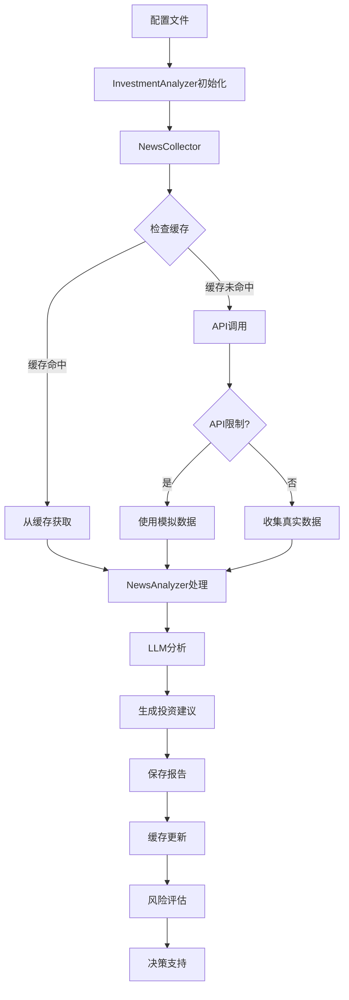

# 量化交易系统架构文档

## 项目概述

本项目是一个基于 Python 的量化交易分析系统，集成了新闻收集、情感分析、投资建议生成、策略开发、数据分析等功能。系统采用模块化设计，支持多种数据源和分析方法，具备完整的缓存机制和配置管理能力。

## 项目目录结构

```
quantitative_trading/
├── README.md                           # 项目主要说明文档
├── README_investment_analysis.md       # 投资分析功能说明
├── requirements.txt                    # Python 依赖包列表
├── 
├── config/                            # 配置文件目录
│   ├── investment_analysis.yaml      # 投资分析配置
│   ├── trading_config.yaml          # 交易策略配置
│   ├── env_example.txt              # 环境变量示例
│   └── stocks/                      # 个股配置目录
│
├── quant/                            # 核心量化分析模块
│   ├── __init__.py                  # 模块初始化
│   ├── news/                        # 新闻分析模块
│   │   ├── __init__.py
│   │   ├── news_collector.py        # 新闻数据收集器
│   │   ├── news_analyzer.py         # 新闻分析器
│   │   └── investment_analyzer.py   # 投资分析器
│   ├── data_providers/              # 数据提供商接口
│   │   ├── __init__.py
│   │   ├── cache_manager.py         # 缓存管理器
│   │   └── base_provider.py         # 基础数据提供商类
│   ├── strategies/                  # 交易策略模块
│   ├── engines/                     # 交易引擎模块
│   ├── agents/                      # 智能代理模块
│   ├── environments/                # 交易环境模拟
│   ├── company_analysis/            # 公司分析模块
│   ├── config/                      # 配置管理模块
│   ├── data/                        # 数据处理模块
│   └── log/                         # 日志管理模块
│
├── demo/                            # 演示脚本目录 (重新组织)
│   ├── README.md                   # 演示脚本说明文档
│   ├── main.py                     # 主演示程序
│   ├── trading/                    # 交易相关演示
│   │   ├── strategy_demo.py        # 交易策略演示
│   │   ├── backtest_demo.py        # 回测演示
│   │   └── portfolio_demo.py       # 投资组合演示
│   ├── analysis/                   # 分析相关演示
│   │   ├── investment_analysis_demo.py      # 投资分析演示
│   │   ├── technical_analysis_demo.py       # 技术分析演示
│   │   ├── fundamental_analysis_demo.py     # 基本面分析演示
│   │   └── risk_analysis_demo.py            # 风险分析演示
│   ├── news/                       # 新闻相关演示
│   │   ├── news_collection_demo.py # 新闻收集演示
│   │   ├── sentiment_analysis_demo.py # 情感分析演示
│   │   └── news_impact_demo.py     # 新闻影响分析演示
│   ├── automation/                 # 自动化演示
│   │   ├── scheduler_demo.py       # 定时任务演示
│   │   ├── alert_demo.py          # 告警系统演示
│   │   └── automation_pipeline_demo.py # 自动化流水线演示
│   └── utils/                      # 工具类演示
│       ├── data_utils_demo.py      # 数据工具演示
│       ├── cache_demo.py           # 缓存功能演示
│       └── config_demo.py          # 配置管理演示
│
├── data/                           # 数据存储目录
│   ├── news/                      # 新闻数据存储
│   ├── tushare/                   # Tushare数据存储
│   ├── market/                    # 市场数据存储
│   ├── analysis/                  # 分析结果存储
│   └── *.csv                      # 各种股票数据文件
│
├── cache/                         # API 响应缓存目录
│   ├── tushare/                  # Tushare API 缓存
│   └── other_providers/          # 其他数据提供商缓存
│
├── reports/                       # 分析报告输出目录
│   ├── daily/                    # 每日报告
│   ├── weekly/                   # 周报告
│   └── YYYY-MM-DD/              # 按日期组织的报告
│
├── logs/                         # 日志文件目录
├── log/                          # 备用日志目录
├── tools/                        # 工具脚本目录
├── docs/                         # 文档目录
│   ├── ARCHITECTURE.md          # 本架构文档
│   ├── investment_analysis_guide.md # 投资分析指南
│   ├── news_module_summary.md   # 新闻模块总结
│   └── value_grid_strategy_guide.md # 价值网格策略指南
├── archive_old_analysis/         # 旧分析数据归档
└── venv/                        # Python 虚拟环境
```

## 核心模块详述

### 1. 新闻分析模块 (`quant/news/`)

#### NewsCollector (新闻收集器)
- **功能**: 从多个数据源收集金融新闻
- **支持的数据源**: 
  - Tushare Pro API (新浪财经、东方财富、华尔街见闻等)
  - 国际新闻源 (Reuters, Bloomberg, CNBC 等)
- **特性**: 
  - 缓存机制，避免重复API调用
  - 批量数据收集
  - 错误处理和重试机制
  - 多线程并发收集

#### NewsAnalyzer (新闻分析器)
- **功能**: 对收集的新闻进行分析和处理
- **能力**:
  - 中文文本分词 (jieba) - 已修复 `add_word()` 函数缺失频率参数的问题
  - 情感分析和情绪识别
  - 关键词提取和主题识别
  - 新闻摘要生成
  - 新闻重要性评分
  - 批量新闻处理和情感分布统计
  - 热门关键词分析和排序

#### InvestmentAnalyzer (投资分析器)
- **功能**: 基于新闻数据生成投资建议
- **特性**:
  - 多投资品支持 (股指、股票、商品、外汇等)
  - LLM 集成 (支持多种大模型提供商)
  - 配置驱动的分析流程
  - 自动化报告生成
  - 风险评估和建议评级

### 2. 数据提供商模块 (`quant/data_providers/`)

#### CacheManager (缓存管理器)
- **功能**: 统一管理 API 响应缓存
- **特性**:
  - 多层次缓存策略
  - 自动过期管理
  - 跨会话缓存共享
  - 缓存统计和监控

#### BaseProvider (基础数据提供商)
- **功能**: 统一的数据源接口
- **特性**:
  - 标准化数据格式
  - 错误处理和重试机制
  - 数据质量验证
  - 支持多数据源聚合

### 3. 策略开发模块 (`quant/strategies/`)

提供多种交易策略的实现和回测框架：
- 趋势跟踪策略
- 均值回归策略
- 技术指标策略
- 基本面分析策略
- 复合策略组合

### 4. 智能代理模块 (`quant/agents/`) **[新增]**

基于 Agent 的智能交易架构是系统的核心创新，提供了更强的智能化和模块化能力：

#### AgentManager (代理管理器)
- **功能**: 中央代理管理和协调系统
- **特性**:
  - 多种 Agent 类型支持 (Grid, DCA, Momentum, Hybrid)
  - 自动生成 Agent 变体和参数组合
  - 并行优化执行引擎
  - 智能推荐和排序系统
  - 性能监控和评估

#### Agent 类型体系

##### GridTradingAgent (网格交易代理)
- **策略特点**: 震荡市场低买高卖
- **参数空间**: 网格层数、间距、基础仓位比例
- **优化范围**: 8-15层网格，1.5%-3%间距
- **适用场景**: 价格震荡、高流动性股票

##### DCAAgent (定投代理)
- **策略特点**: 定期定额投资，风险分散
- **参数空间**: 投资频率、投资金额、基础仓位比例
- **优化范围**: 周/月频率，1000-5000元额度
- **适用场景**: 长期投资、分散风险

##### MomentumAgent (动量代理)
- **策略特点**: 趋势跟随交易
- **参数空间**: 回望期、触发阈值、基础仓位比例
- **优化范围**: 15-30天回望期，5%-10%阈值
- **适用场景**: 趋势明确的市场

##### HybridAgent (混合代理)
- **策略特点**: 多策略权重组合
- **参数空间**: 各策略权重分配
- **优化范围**: 动态权重调整
- **适用场景**: 复杂市场环境

#### Agent 优化框架

##### 分层优化策略
- **Level 1**: Agent 类型选择 (策略类型适配)
- **Level 2**: Agent 参数优化 (参数空间搜索)
- **Level 3**: 多 Agent 组合 (投资组合优化)

##### 智能推荐系统
- 基于历史性能的推荐算法
- 市场环境适应性评估
- 风险调整收益排序
- 策略组合建议生成

#### 新旧架构对比

```
传统架构:
Stock Analyzer → Strategy Parameters → Backtest Engine → Results

新 Agent 架构:
Stock Analyzer → Agent Manager → Agent Variants → Parallel Optimization → Intelligent Recommendations
```

#### 技术优势
1. **更强的抽象能力**: Agent 封装了完整的策略逻辑
2. **更好的扩展性**: 新策略类型可以轻松添加为新 Agent
3. **智能参数管理**: 每种 Agent 类型有专门的参数空间定义
4. **并行优化**: 支持大量 Agent 变体的并行测试
5. **性能评估标准化**: 统一的性能指标和排序机制

### 5. 演示脚本模块 (`demo/`)

重新组织的演示脚本提供完整的功能展示：

#### 交易相关演示 (`demo/trading/`)
- **策略演示**: 展示各种交易策略的实现和使用
- **回测演示**: 策略历史表现回测和分析
- **投资组合演示**: 多资产投资组合构建和优化

#### 分析相关演示 (`demo/analysis/`)
- **投资分析演示**: 基于新闻和数据的投资建议生成
- **技术分析演示**: 技术指标计算和图表分析
- **基本面分析演示**: 公司财务数据分析
- **风险分析演示**: 风险评估和管理

#### 新闻相关演示 (`demo/news/`)
- **新闻收集演示**: 从多数据源收集和处理新闻
- **情感分析演示**: 新闻情感和市场影响分析
- **新闻影响演示**: 新闻对股价影响的量化分析

#### 自动化演示 (`demo/automation/`)
- **定时任务演示**: 自动化分析和报告生成
- **告警系统演示**: 市场异常和机会告警
- **自动化流水线演示**: 完整的自动化交易流程

### 6. 配置管理

#### 投资分析配置 (`config/investment_analysis.yaml`)
- **LLM 配置**: 大模型提供商、API密钥、模型参数
- **投资品配置**: 目标投资品列表、关键词、权重
- **新闻源配置**: 数据源选择、搜索参数
- **分析配置**: 分析维度、阈值设置
- **缓存配置**: 缓存策略、过期时间

## 数据流程



## 技术栈

### 核心依赖
- **Python 3.8+**: 主要编程语言
- **pandas**: 数据处理和分析
- **numpy**: 数值计算
- **tushare**: 金融数据接口
- **jieba**: 中文分词
- **PyYAML**: 配置文件解析
- **requests**: HTTP 请求
- **schedule**: 定时任务调度

### 可选依赖
- **OpenAI API**: GPT模型集成
- **transformers**: 本地NLP模型
- **matplotlib/plotly**: 数据可视化
- **scikit-learn**: 机器学习算法
- **ta-lib**: 技术分析指标库

### 开发工具
- **pytest**: 单元测试框架
- **black**: 代码格式化
- **flake8**: 代码质量检查
- **mypy**: 类型检查

## 扩展性设计

### 1. 数据源扩展
- 新数据源只需实现标准接口
- 支持多数据源并行收集
- 统一的数据格式标准化
- 插件式数据源管理

### 2. 分析方法扩展
- 插件式分析器架构
- 可配置的分析维度
- 多模型集成支持
- 自定义分析策略

### 3. 策略扩展
- 标准化策略接口
- 策略组合和优化
- 动态策略切换
- 策略性能评估

### 4. 报告格式扩展
- 支持多种输出格式 (JSON, Markdown, HTML, PDF)
- 模板化报告生成
- 自定义报告样式
- 交互式报告界面

## 配置管理原则

### 1. 分离关注点
- 实际配置文件存储在 `config/` 目录
- 配置相关代码存储在 `quant/config/`
- 环境相关配置通过环境变量管理
- 个股配置独立管理

### 2. 通用化设计
- 分析代码通用化，参数通过配置文件传递
- 避免硬编码公司或产品特定逻辑
- 支持批量配置和动态配置更新
- 配置验证和默认值管理

### 3. 层次化配置
- 全局配置 > 模块配置 > 个股配置
- 配置继承和覆盖机制
- 运行时配置动态调整

## 缓存策略

### 1. 分层缓存
- **内存缓存**: 会话期间的临时数据
- **文件缓存**: 跨会话的持久化缓存
- **数据库缓存**: 大规模数据的结构化存储
- **分布式缓存**: 支持多实例共享

### 2. 智能过期
- 新闻数据: 6-24小时过期
- 市场数据: 按数据频率动态调整
- 分析结果: 根据分析类型动态调整，新闻分析报告保存在 `reports/` 目录
- API响应: 按提供商限制策略管理

### 3. 缓存优化
- 数据压缩存储
- 异步缓存更新
- 缓存预热机制
- 缓存监控和统计

## 错误处理

### 1. API限制处理
- 自动检测API调用限制
- 指数退避重试策略
- 模拟数据回退机制
- 多数据源容错

### 2. 数据质量保证
- 数据验证和清洗
- 异常数据标记和处理
- 数据来源追踪
- 数据完整性检查

### 3. 系统稳定性
- 异常监控和告警
- 自动恢复机制
- 降级策略
- 灾难恢复

## 日志和监控

### 1. 分级日志
- **DEBUG**: 详细调试信息
- **INFO**: 一般流程信息
- **WARNING**: 警告和非关键错误
- **ERROR**: 严重错误和异常
- **CRITICAL**: 系统级严重问题

### 2. 性能监控
- API调用次数和响应时间统计
- 缓存命中率监控
- 分析任务执行时间跟踪
- 内存和CPU使用率监控

### 3. 业务监控
- 交易策略性能监控
- 投资建议准确性跟踪
- 风险指标监控
- 用户行为分析

## 部署和运维

### 1. 环境管理
- 虚拟环境隔离
- 依赖版本锁定
- 配置文件模板化
- 多环境配置管理

### 2. 自动化运维
- 定时任务调度
- 自动报告生成
- 异常情况通知
- 系统健康检查

### 3. 容器化部署
- Docker镜像构建
- 容器编排
- 服务发现
- 负载均衡

## 安全考虑

### 1. API密钥管理
- 环境变量存储
- 配置文件加密
- 访问权限控制
- 密钥轮换机制

### 2. 数据安全
- 敏感数据脱敏
- 本地数据加密存储
- 网络传输安全
- 数据访问审计

### 3. 系统安全
- 输入验证和过滤
- SQL注入防护
- XSS攻击防护
- 安全漏洞扫描

## 开发规范

### 1. 代码风格
- 函数名和变量采用驼峰风格
- 注释、日志、异常信息使用英文
- 用户界面和文档使用中文
- 遵循PEP 8规范

### 2. 模块职责
- 单一职责原则
- 松耦合设计
- 清晰的接口定义
- 依赖注入模式

### 3. 测试规范
- 单元测试覆盖率 > 80%
- 集成测试和端到端测试
- 性能测试和压力测试
- 自动化测试流程

### 4. 文档规范
- API文档自动生成
- 代码注释完整性
- 用户手册和开发指南
- 架构设计文档

## 性能优化

### 1. 计算优化
- 向量化计算
- 并行处理
- 内存管理优化
- 算法复杂度优化

### 2. I/O优化
- 异步I/O操作
- 批量数据处理
- 连接池管理
- 缓存策略优化

### 3. 网络优化
- HTTP连接复用
- 数据压缩传输
- CDN加速
- 负载均衡

## 未来扩展方向

### 1. 功能扩展
- 实时交易执行
- 高频交易支持
- 多市场交易
- 衍生品交易
- 投资组合优化
- 风险管理增强

### 2. 技术升级
- 微服务架构
- 容器化部署
- 云原生支持
- 实时数据流处理
- 机器学习集成
- 区块链集成

### 3. 用户体验
- Web界面开发
- 移动端应用
- 数据可视化增强
- 交互式分析工具
- 用户个性化定制

### 4. 生态建设
- 插件市场
- 开放API
- 社区建设
- 第三方集成

## 版本管理

### 1. 版本控制
- Git分支管理策略
- 代码审查流程
- 自动化CI/CD
- 版本发布管理

### 2. 数据版本
- 数据模型版本控制
- 配置版本管理
- 分析结果版本追踪
- 回滚和恢复机制

## 最近更新日志

### 2025年6月2日
- **新闻分析功能修复**: 修复了 `jieba` 库 `add_word()` 函数缺失频率参数的问题
- **投资分析增强**: 改进了投资分析报告，增加了新闻来源和链接以提高可解释性
- **功能验证**: 成功运行新闻分析功能，分析了849条新闻数据，生成了情感分布和热门关键词统计
- **报告输出**: 新闻分析报告保存在 `reports/news_analysis_YYYYMMDD_HHMMSS.json` 格式

---

*本文档持续更新，反映项目架构的最新状态。如有疑问请查看相关源码或联系维护团队。* 

*最后更新: 2025年6月2日* 