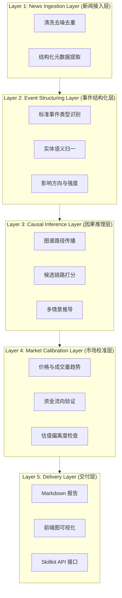
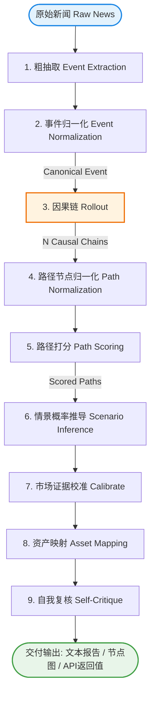

# 新闻事件投资概率图能力设计

最后更新: 2026-03-15

## 1. 背景

本设计面向一个明确目标：基于新的新闻事件，生成可解释的投资概率图推导能力，用于辅助判断某一事件将如何影响行业、主题、资产和候选标的。

当前仓库已经具备若干相关基础能力，但还缺少“事件驱动推理层”：

- [investment_advisor.py](../../quant/analysis/advisor/investment_advisor.py)
  - 已具备多标的聚合分析、数据源接入、技术面/资金流/估值的综合分析能力
- [capital_flow_visualizer.py](../../quant/analysis/indicators/capital_flow_visualizer.py)
  - 已具备图表输出与结果可视化能力
- [page_data_skillkit.py](../../web/skillkits/page_data_skillkit.py)
  - 已具备 Skillkit 风格的工具注册与 Agent 集成模式

从业务角度看，现有能力更偏“给定标的做分析”，缺少“给定事件反推出候选机会与风险”的能力。从产品角度看，用户想要的不是一段新闻摘要，而是一个能够回答以下问题的能力：

- 这条新闻本质上是什么事件
- 它会通过哪些传导链条影响市场
- 影响方向、强度、时滞和置信度分别如何
- 哪些资产最可能受益，哪些最可能受损
- 在什么条件下这个推理会失效

因此，该能力的本质不是新闻总结，而是事件驱动的投资因果推理。

## 2. 设计思路折衷

### 2.1 为什么不能做成纯新闻摘要

如果系统只做“新闻 -> 一段结论”，会有几个问题：

- 结论不可复盘，后续无法判断错在事件理解还是错在资产映射
- 结论不可校准，无法接入价格、成交量、资金流等后验证据
- 结论不可沉淀，无法逐步积累领域因果知识

因此设计上必须先将新闻抽象为结构化事件，再进入推理过程。

### 2.2 为什么不能完全依赖 LLM 自由推理

在投资场景里，纯 LLM 推理虽然灵活，但存在明显风险：

- 同一事件多次运行结果可能不稳定
- 容易把相关性误当因果性
- 容易过度泛化，导致“利好行业 = 利好所有个股”
- 无法明确表达边界条件和失效条件

因此本方案采用“规则图谱约束 + LLM 补全解释”的折衷方案。

### 2.3 为什么也不能只做静态规则系统

如果完全采用规则系统，问题则在于：

- 新闻文本表达复杂，多来源表述差异大
- 新事件层出不穷，人工规则难以及时覆盖
- 解释文本会僵硬，用户体验较差

因此更合理的折衷是：

- LLM 负责事件抽取、候选链路补全、解释生成
- 规则图谱负责方向约束、行业映射、边权重、冲突消解
- 市场数据负责后验校准，降低文本推理偏差

### 2.4 核心折衷结论

第一版不做黑盒预测器，而做“可解释概率推理器”。

整体推理链路为：

```text
Raw News
-> Structured Event
-> Causal Graph Propagation
-> Scenario Probability Inference
-> Market Evidence Calibration
-> Investment Mapping Output
```

### 2.5 第一版范围折衷

为了控制复杂度，V1 只覆盖三类高价值、易验证事件：

1. 政策监管事件
2. 行业供需事件
3. 公司重大事项

第一版不追求：

- 自动交易执行
- 覆盖全部新闻类型
- 全市场全资产实时联动
- 复杂在线学习或自动调参系统

## 3. 总体设计

本章概述“新闻事件投资概率图”的系统架构、数据流转以及分层设计。为了更直观展示整体结构，首先给出系统核心的分层架构图和处理流程图。

### 3.1 架构与流程总览

#### 分层逻辑架构图



#### 核心推导流程图



### 3.2 目标定义

给定一条或多条新闻，系统应输出四类结果：

1. 结构化事件卡
2. 影响传导图
3. 概率推导演算结果
4. 投资映射清单

其中，“概率图”不是单点预测，而是多情景概率分布。建议统一为：

- Bull
- Base
- Bear

每种情景都需要显式给出：

- 概率
- 成立条件
- 关键影响对象
- 时滞
- 风险点

### 3.3 分层逻辑架构

总体采用五层逻辑架构：

```text
Layer 1: News Ingestion Layer
Layer 2: Event Structuring Layer
Layer 3: Causal Inference Layer
Layer 4: Market Calibration Layer
Layer 5: Delivery Layer
```

#### Layer 1: News Ingestion Layer

职责：

- 接收新闻正文、标题、来源、发布时间、URL
- 做基础清洗、去噪、去重
- 生成统一输入对象

输出：

- 原始新闻输入对象

这一层不做投资推理，只负责建立可靠输入边界。

#### Layer 2: Event Structuring Layer

职责：

- 从新闻中提取事件类型、实体、行业、方向、证据句
- 规范化不同表述，将新闻归并到统一事件类型

输出：

- 标准化事件对象 `Event`

这一层决定后续推理的上限。若事件类型归类错误，后续图谱传播很容易整体偏移。

#### Layer 3: Causal Inference Layer

职责：

- 从标准事件出发，在因果图谱中传播
- 生成若干条“事件 -> 中间变量 -> 行业/主题 -> 资产”的可解释路径
- 形成初始方向判断与强度打分

输出：

- 因果路径集合
- 初始资产影响集合
- 多情景候选解释

这一层是能力核心，必须优先保证可解释性，而不是追求链路数量。

#### Layer 4: Market Calibration Layer

职责：

- 用价格走势、成交量、资金流、估值等市场证据修正文本推理结果
- 区分“逻辑成立但市场尚未交易”和“逻辑成立但市场已经过度交易”

输出：

- 校准后的情景概率
- 校准后的标的影响分数
- 风险提示

这一层使系统从“文本观点生成器”转向“有后验证据约束的分析器”。

#### Layer 5: Delivery Layer

职责：

- 输出 Markdown 报告
- 输出前端可渲染的图结构
- 通过 Skillkit 暴露给 Web Agent 或其他调用方

输出：

- 文本报告
- 图节点边结构
- Tool/Skill API 返回值

### 3.4 关键数据流

```text
News
-> Parse
-> Normalize
-> Traverse Graph
-> Build Scenarios
-> Calibrate With Market Evidence
-> Map To Assets
-> Render Report / Graph / Skill Response
```

### 3.5 与现有系统的关系

该能力不替代现有 `InvestmentAdvisor`，而是作为它的上游候选生成器和事件解释层：

- 事件系统负责“从新闻出发发现可能受影响的资产”
- 现有分析器负责“对候选资产补充技术面、资金流、估值信息”

最终可形成：

```text
新闻事件推理
+ 市场数据校准
+ 标的深度分析
= 事件驱动投资判断
```

## 4. 事件推导机制

### 4.1 设计目标

事件推导机制解决的问题不是“如何总结一条新闻”，而是“如何从一条新闻推导出对投资对象的影响路径、方向、强度、时滞和概率”。

为保证结果可解释、可校准、可复盘，推导过程不能直接从原始新闻跳到最终结论，而应经过结构化和分层传播。

### 4.2 推导总流程

建议采用以下五步流程：

```text
News
-> Structured Event Extraction
-> Causal Graph Propagation
-> Path Scoring
-> Scenario Probability Inference
-> Market Evidence Calibration
```

### 4.3 多阶段推理机制

“多次推理”不应理解为在一个 Prompt 中要求模型“多想几次”，而应体现在系统级流程设计上，即将一次结论拆分为多轮目标明确、逐步收敛的推理阶段。

建议在事件推导机制中显式引入多阶段推理：

```text
Round 1: Event Extraction
Round 2: Event Normalization
Round 3: Causal Chain Rollout
Round 4: Path Normalization
Round 5: Path Scoring
Round 6: Scenario Inference
Round 7: Market Evidence Calibration
Round 8: Asset Mapping
Round 9: Self-Critique And Risk Check
```

关键设计决策：归一化分为两个层次，分别作用于 Rollout 的前后两侧：

- 事件归一化（Round 2）在 Rollout 之前：事件类型是有限的、可穷举的（如 `policy_export_control`），提前归一化为 Rollout 提供清晰的起点。
- 路径归一化（Round 4）在 Rollout 之后：因果链上衍生出的中间概念是开放的、不断涌现的，如果提前用静态词库限制，会丢失新概念和新路径。先让 LLM 自由展开因果链，再对链上节点做归一化，已有图谱就从"推理轨道"变成了"打分参考系"——不限制发现，但给已知路径更高的置信度。

各轮职责如下：

1. `Round 1: Event Extraction`
   - 目标：从新闻中粗抽取候选事件对象（发生了什么、涉及谁、大致方向）
   - 输入：原始新闻文本、标题、来源、时间
   - 输出：`raw_event_candidates`

2. `Round 2: Event Normalization`
   - 目标：将候选事件归并到标准事件类型和标准实体（如 `policy_export_control`）
   - 输入：`raw_event_candidates`
   - 输出：`canonical_event`
   - 规则：事件类型空间有限且可穷举，此处归一化为后续 Rollout 提供明确的起点锚定

3. `Round 3: Causal Chain Rollout`
   - 目标：从标准事件出发，LLM 自由展开 N 条候选因果链（建议 N=5~10），每条链经中间变量到达行业/主题/资产
   - 输入：`canonical_event`
   - 输出：`rollout_causal_chains`（每条链包含方向标注）
   - 要求：不限制 LLM 只能使用已有图谱节点，允许发现新概念

4. `Round 4: Path Normalization`
   - 目标：对 rollout 产出的所有链上中间节点做归一化
   - 输入：`rollout_causal_chains`
   - 输出：`normalized_causal_chains`
   - 规则：已知节点对齐标准词库；未知节点走 5.9 Provisional Node 流程（强制锚点挂靠 + 向量去重）

5. `Round 5: Path Scoring`
   - 目标：对归一化后的路径打分，综合图谱先验边权、来源可信度和市场证据
   - 输入：`normalized_causal_chains`
   - 输出：`scored_paths`（每条路径含 score、direction、confidence）
   - 规则：命中已有图谱边的路径获得先验加分，纯 LLM 发现的新路径需市场证据支持

6. `Round 6: Scenario Inference`
   - 目标：基于 Rollout 的统计分布计算 Bull / Base / Bear 情景概率
   - 输入：`scored_paths`
   - 输出：`scenario_set`
   - 计算逻辑：N 条 rollout 路径本身就是一次蒙特卡洛采样，其方向分布和分数分布直接构成概率估计的基础，而非由 LLM 另行给出概率数字。具体方式为：按方向分组统计路径条数与平均分，以 `count * avg_score` 做加权归一化得到各情景概率

7. `Round 7: Market Evidence Calibration`
   - 目标：使用价格、成交量、资金流、估值等数据修正情景概率
   - 输入：`scenario_set`
   - 输出：`calibrated_scenarios`

8. `Round 8: Asset Mapping`
   - 目标：将校准后的结论映射到行业、ETF、个股或观察名单
   - 输入：`calibrated_scenarios`
   - 输出：`asset_impacts`

9. `Round 9: Self-Critique And Risk Check`
   - 目标：检查推理链中的薄弱假设、反例和失效条件
   - 输入：`asset_impacts`
   - 输出：`risk_notes` 与 `invalid_conditions`

该机制的价值在于：

- 每轮只解决一个窄问题，降低单轮推理复杂度
- 每轮都保留中间结果，便于复盘和调试
- 可以在任意一轮接入规则、模型或市场数据约束
- 先发散（Rollout）后收敛（归一化 + 打分），而不是一开始就用静态图谱限制推理空间
- 情景概率从 rollout 分布中涌现，而非 LLM 单次输出

建议在系统内部显式保留多轮推理状态，例如：

```json
{
  "round_1_event_candidates": [],
  "round_2_canonical_event": {},
  "round_3_rollout_causal_chains": [],
  "round_4_normalized_chains": [],
  "round_5_scored_paths": [],
  "round_6_scenarios": [],
  "round_7_calibrated_scenarios": [],
  "round_8_asset_impacts": [],
  "round_9_risk_notes": []
}
```

这样“多次推理”就不只是方法论表述，而是系统设计中的显式对象和可观察过程。

### 4.4 第一步: 结构化事件抽取

原始新闻首先要转换为标准事件对象，而不是直接输出“利好什么股票”。

建议至少抽取以下字段：

- `event_type`
- `entities`
- `direction`
- `magnitude`
- `time_horizon`
- `confidence`
- `evidence`

这一阶段的重点是把自然语言新闻压缩为可计算的事件表示。

### 4.5 第二步: 因果图传播

结构化事件进入因果图谱后，沿预定义边做逐层传播。

传播的基本形式是：

```text
事件
-> 中间经济变量
-> 行业 / 主题
-> 资产篮子 / 标的
```

示例：

```text
出口限制升级
-> 高端芯片供给受限
-> 国产替代预期增强
-> 国产 GPU / 服务器 / 封装链受益
```

这里的“中间经济变量”非常关键，因为它决定系统是在做因果推理，还是只是在做关键词联想。

### 4.6 第三步: 路径打分

每条边应具备明确属性，而不是只有“能连通”：

- `impact_sign`
- `strength`
- `lag`
- `condition`
- `reliability`

整条路径分数建议综合以下因素：

- 事件本身强度
- 边权传播结果
- 来源可信度
- 历史相似事件支持度

可采用乘积或加权累计方式生成路径总分，但 V1 应优先选择简单、稳定、易解释的打分逻辑。

### 4.7 第四步: 情景概率推导

推导结果不应是单点结论，而应统一输出多情景分布。建议固定为：

- Bull
- Base
- Bear

每个情景至少包含：

- 概率
- 成立条件
- 关键受影响对象
- 时滞
- 风险点

这样可以避免“模型看起来很确定，但实际上没有表达不确定性”的问题。

### 4.8 第五步: 市场后验校准

在文本推理完成后，再引入市场证据做后验修正。

重点校准问题包括：

- 逻辑虽然成立，但市场是否已经提前交易
- 逻辑虽然成立，但市场是否没有确认
- 逻辑成立的方向，是否和资金流、价格趋势冲突

建议纳入的校准因子：

- 价格趋势
- 成交量
- 资金流向
- 相对强弱
- 估值水平

### 4.9 推导机制的核心约束

为了避免系统退化成“自动编故事”，推导必须满足以下约束：

- 任何结论都必须能回溯到 `reason_chain`
- 任何高置信度判断都必须有图谱支持或市场证据支持
- 任何正向结论都必须包含至少一个 `risk_note`
- 任何资产映射都必须区分“直接影响”和“间接影响”

## 5. 事件语义统一机制

### 5.1 设计目标

事件语义统一的目标，是把不同来源、不同措辞、不同语言风格下的新闻表达，归并到同一套标准事件语义空间中。

如果做不到语义统一，会直接导致以下问题：

- 同类事件无法共用一套图谱传播逻辑
- 回测样本无法聚合
- 不同新闻对同一事件会产生不一致推导
- 图谱和规则无法持续沉淀

### 5.2 统一的三个层次

事件语义统一建议分为三层：

1. 事件类型统一
2. 实体语义统一
3. 动作语义统一

### 5.3 事件类型统一

第一层是将新闻归并到受控的标准事件类型集合中，而不是允许系统自由生成无限多标签。

V1 建议从小而稳的 taxonomy 开始，例如：

- `policy_export_control`
- `policy_subsidy`
- `industry_price_increase`
- `industry_capacity_cut`
- `company_earnings_beat`
- `company_mna`
- `company_accident`
- `company_large_order`

示例：

- “美国扩大 AI 芯片出口限制”
- “新增先进制程设备对华出口管制”
- “进一步收紧高端算力芯片出口政策”

都应统一映射为：

- `policy_export_control`

### 5.4 实体语义统一

第二层是对公司、国家、行业、主题和商品做统一实体映射。

需要解决的问题包括：

- 中英文别名不一致
- 股票代码与公司名混用
- 行业和主题表述粒度不一致
- 同义概念并存

例如：

- “英伟达” / “NVIDIA” / “NVDA”
- “算力链” / “AI 基础设施” / “数据中心算力”

都应分别映射到统一的标准实体或主题节点。

### 5.5 动作语义统一

第三层是统一新闻里的动作表达，因为很多事件影响并不是由名词决定，而是由动作方向决定。

例如以下词语本质都可能表示监管收紧：

- 收紧
- 限制
- 禁止
- 管制升级
- 扩大限制范围

建议统一映射到标准动作语义，例如：

- `constraint_up`

类似地，也可定义：

- `subsidy_up`
- `capacity_down`
- `demand_up`
- `cost_up`
- `guidance_raise`
- `guidance_cut`

### 5.6 统一流程

建议采用“抽取 + 规则映射 + 相似度回退”的三级统一流程：

```text
Raw News
-> LLM Extract Candidate Labels
-> Rule-Based Canonical Mapping
-> Similarity Fallback
-> Standard Event Representation
```

优先级建议如下：

1. 精确规则命中
2. 别名字典映射
3. 相似度匹配回退
4. 人工补充新类型

其中，LLM 负责给出候选分类，最终的标准标签由规则系统收敛，避免标签漂移。

### 5.7 统一后的标准表示

语义统一完成后，新闻应转为标准事件表示，再进入推理阶段。

示例：

```json
{
  "event_type": "policy_export_control",
  "entities": ["US", "China", "AI_chip", "advanced_semiconductor_equipment"],
  "direction": "mixed",
  "time_horizon": "short_term_to_medium_term"
}
```

系统后续应基于这个标准表示做图谱传播，而不是继续直接依赖原始新闻句子。

### 5.8 统一机制的维护原则

V1 阶段不追求 taxonomy 很大，而是追求：

- 类型少但定义清晰
- 归并规则稳定
- 别名字典可维护
- 未命中类型可追踪

对未覆盖的新事件，应优先记录为候选标准类型，再决定是否纳入正式 taxonomy，而不是让系统即时创造永久标签。

### 5.9 动态概念发现与图谱自演进机制

前述 5.1-5.8 解决的是入口侧（Layer 2）的归一化问题，但在 Layer 3 因果传播阶段，图谱中会衍生出新的中间概念（MacroFactor、IndustryFactor、Theme 等），这些概念同样需要被标准化。如果仅依赖预建的静态词库，系统会无法跟踪市场上不断涌现的新概念（如"低空经济"、"固态电池"、"Sora 概念"等），导致推导链路断裂或遗漏关键投资机会。

为了在「确定性」和「覆盖度」之间取得平衡，建议引入以下四级动态演进机制：

#### 5.9.1 开放式抽取与强制锚点挂靠

在因果传播阶段，允许 LLM 输出标准词库之外的新概念，但必须同时提供一个词库内的「上级锚点（Anchor）」。这保证即使下游系统不认识新词，也能通过锚点获得一个大方向的兜底。

示例：

```json
{
  "novel_theme": "飞行汽车",
  "anchor_industry": "AUTOMOBILE_AND_AEROSPACE",
  "node_status": "provisional"
}
```

#### 5.9.2 向量空间消解去重

新概念产生后，计算其 Embedding 向量，在现有图谱节点库中检索 Top-1 相似度：

- 相似度 >= 0.85：判定为同义词，自动归并到已有标准节点（如"钠离子电池"归并到已有的"钠电池"）
- 相似度 < 0.85：确认为全新概念，创建为临时节点 `ProvisionalNode`

该步骤避免同一概念因 LLM 表述不稳定而被反复创建为不同节点。

#### 5.9.3 市场证据验真（Provisional Node 生存测试）

临时节点不直接参与最终资产映射。它必须通过市场证据验真后才能被信任：

1. 动态映射候选标的：基于公司主营业务向量库，检索出与新概念最相关的候选标的池（如 10 只）
2. 行情异动检测：检查这些标的在事件发生后的成交量、涨跌幅、资金流是否出现统计显著异动
3. 生存判定：
   - 若无明显市场响应：临时节点置信度降为 0，标记为 `rejected`，不进入最终输出
   - 若出现明显资金共振：临时节点被标记为 `confirmed`，进入正式输出并携带市场验证证据

#### 5.9.4 图谱自动新陈代谢

通过上述流程，图谱具备自我演进能力：

- 每日收盘后 Batch 任务扫描所有 `confirmed` 状态的临时节点
- 自动将其写入 `taxonomy.yaml` 和 `sector_asset_mapping.yaml`
- 同时发送通知给研究员 Review，确保人工可追溯
- 长期未被再次触发的节点（如 30 天无命中）自动降级为 `archived`

该机制的核心价值在于：

- LLM 负责发现新概念
- 向量库负责防止重复造词
- 市场资金负责提供生存许可
- 系统自动将存活者沉淀进标准图谱

从而实现低人工干预下的图谱新陈代谢，避免预建库的覆盖度瓶颈。

## 6. 多次 Rollout 机制

### 6.1 设计目标

“多阶段推理”和“多次 Rollout”不是同一个概念。

- 多阶段推理解决的是单次事件处理内部如何逐步收敛
- 多次 Rollout 解决的是系统如何对同一事件、同类事件和不同版本策略反复运行、比较和校准

因此，两者应同时存在，且互不冲突。

### 6.2 Rollout 的三个层次

建议将 Rollout 分为三层：

1. 单事件内 Rollout
2. 历史批量 Rollout
3. 多版本对比 Rollout

### 6.3 单事件内 Rollout

这是最直接的一层，用于同一条新闻在单次处理时进行多轮展开、筛选和复核。

目标：

- 让系统不是一次性输出答案
- 让推理链可以在不同阶段逐步收敛
- 让最终结果保留反证和失效条件

该层主要复用前文定义的多阶段推理机制。

### 6.4 历史批量 Rollout

该层用于将同一版本的规则、提示词和图谱配置，批量运行在一组历史新闻事件上。

目标：

- 评估系统在历史样本上的方向准确率
- 识别哪类事件稳定，哪类事件容易误判
- 为后续规则修正和图谱扩展提供依据

建议保留以下输出：

- 标准事件对象
- 推导路径
- 情景概率
- 候选资产
- 后续 1 / 3 / 5 / 20 交易日表现

### 6.5 多版本对比 Rollout

该层用于在相同历史样本集上，对不同版本配置进行对比。

可对比的对象包括：

- Prompt 版本
- 规则版本
- 图谱版本
- 边权版本
- 市场校准权重版本

目标：

- 比较不同版本的准确率和稳定性
- 识别哪种设计更可解释
- 防止系统在局部优化后整体退化

### 6.6 Rollout 的关键评估维度

建议至少评估以下指标：

- 方向准确率
- Top-K 命中率
- 高置信度样本表现
- 概率校准误差
- 不同事件类型的分布表现
- 输出稳定性

其中，“输出稳定性”指同一事件在重复运行或轻微输入扰动下，是否仍能得到相近的事件分类、主要路径和资产映射结果。

### 6.7 Rollout 的工程要求

要支持多次 Rollout，系统需要具备以下工程能力：

- 推理过程可回放
- 中间状态可持久化
- Prompt / 规则 / 图谱版本可追踪
- 结果可批量比对
- 样本和结果可复现实验

建议每次 Rollout 保留：

- `run_id`
- `event_id`
- `prompt_version`
- `graph_version`
- `rule_version`
- `calibration_version`
- `final_output`
- `evaluation_result`

### 6.8 Rollout 设计结论

对本能力而言：

- 单次事件分析依赖多阶段推理
- 系统长期演进依赖多次 Rollout

因此架构上应把“推理阶段管理”和“实验运行管理”分开建模，而不是混在一个大函数里。

## 7. 智能体要求与系统依赖

### 7.1 对智能体的能力要求

该能力对应的智能体，不应只是一个通用新闻总结器，而应是一个具备结构化输出、分阶段执行、工具调用和自我复核能力的事件推理智能体。

建议至少满足以下要求：

1. 结构化约束能力
   - 能稳定输出 schema 化结果，而不是只输出自然语言
2. 分阶段执行能力
   - 能按轮次完成抽取、归一化、路径生成、筛选、情景推导、校准和复核
3. 自我审查能力
   - 能识别薄弱假设、反例和失效条件
4. 工具调用能力
   - 能访问新闻、图谱、市场数据和已有分析模块
5. 可回放能力
   - 能保留中间推理状态，支持复盘和对比
6. 稳定性优先
   - 在投资场景下优先保证一致性和可控性，而不是追求自由发挥

### 7.2 模型依赖

从系统设计角度，建议区分两类模型职责：

1. 主推理模型
   - 负责事件抽取、候选链路补全、解释生成
2. 复核模型或复核阶段
   - 负责风险检查、反证分析、输出稳定性复查

第一版不一定必须使用两个不同模型，但逻辑上应区分“生成”和“审查”两类职责，避免单轮输出直接成为最终结论。

### 7.3 规则与知识依赖

这是系统稳定性的关键依赖，不应缺失。

建议依赖以下知识资产：

- 事件 taxonomy
- 实体别名字典
- 动作语义字典
- 因果边图谱
- 行业到资产映射表
- 失效条件规则

没有这些知识层，系统会退化为“看起来会说，但难以复盘”的黑盒分析器。

### 7.4 数据依赖

要让系统从文本推理升级为投资推理，必须依赖外部数据。

建议接入：

- 新闻源数据
- 行情数据
- 成交量数据
- 资金流向数据
- ETF / 个股估值数据
- 行业分类和主题映射数据

数据依赖的核心作用不是增加信息量，而是为推理结果提供后验约束。

### 7.5 系统依赖

为了支持多轮推理和多次 Rollout，需要以下系统基础设施：

- 缓存
- 推理状态存储
- 结果版本化
- Prompt / 规则 / 图谱配置管理
- 离线评估任务
- 日志和可观测性

如果缺少这些基础设施，系统很难从“可以演示”走向“可以演进”。

### 7.6 与现有仓库的依赖结合点

本仓库已有若干可以直接复用的能力：

- `InvestmentAdvisor`
  - 可作为市场证据校准和候选标的补充分析入口
- 资金流、估值、可视化模块
  - 可作为后验修正与结果展示基础
- `Skillkit` 模式
  - 可用于将事件推理能力暴露给 Web Agent

因此，新能力不应绕开现有基础件重新造轮子，而应以服务层方式把这些能力编排起来。

### 7.7 智能体设计结论

该智能体的合理定位是：

- 不是通用问答 Agent
- 不是单轮新闻总结 Agent
- 而是一个“有结构化约束、有知识图谱约束、有市场数据校准、有复核机制”的事件投资推理 Agent

## 8. 模块设计

### 8.1 模块划分

建议新增以下目录结构：

```text
quant/
└── analysis/
    └── event_investment/
        ├── event_models.py
        ├── news_event_parser.py
        ├── event_normalizer.py
        ├── causal_graph_engine.py
        ├── scenario_probability_engine.py
        ├── market_evidence_calibrator.py
        ├── investment_mapper.py
        └── event_probability_service.py

quant/
└── knowledge/
    └── event_graph/
        ├── event_taxonomy.yaml
        ├── causal_edges.yaml
        ├── sector_asset_mapping.yaml
        └── trigger_rules.yaml

web/
└── skillkits/
    └── news_event_skillkit.py
```

### 8.2 `event_models.py`

职责：

- 定义核心领域对象
- 提供统一类型边界

建议包含：

- `Event`
- `CausalEdge`
- `Scenario`
- `AssetImpact`

示例：

```python
@dataclass
class Event:
    event_id: str
    title: str
    source: str
    published_at: str
    event_type: str
    summary: str
    entities: list[str]
    regions: list[str]
    sectors: list[str]
    direction: str
    magnitude: float
    urgency: str
    time_horizon: str
    confidence: float
    evidence: list[str]
```

### 8.3 `news_event_parser.py`

职责：

- 将原始新闻解析为初始结构化事件
- 识别标题、主体实体、事件行为、方向和证据句

设计要点：

- 允许 LLM 参与抽取
- 输出必须受结构化 schema 约束
- 对缺失字段做显式标记，而不是隐式猜测

输入：

- `news_text`
- `title`
- `source`
- `published_at`

输出：

- 原始结构化事件对象

### 8.4 `event_normalizer.py`

职责：

- 将不同说法归并到统一事件类型
- 对实体、行业、地区做标准化映射

示例：

- “扩大高端芯片出口限制”
- “新增先进制程设备出口管制”
- “进一步收紧 AI 芯片出口政策”

可统一映射到：

- `policy_export_control`

设计要点：

- 优先用规则归一化
- LLM 只在模糊匹配时辅助建议候选分类

### 8.5 `causal_graph_engine.py`

职责：

- 在图谱中做影响传播
- 输出 1 到 3 条主要传导链
- 控制传播深度，避免图过度发散

图中的节点建议包括：

- Event
- MacroFactor
- IndustryFactor
- Theme
- AssetBasket
- Symbol

边的属性建议包括：

- `impact_sign`
- `strength`
- `lag`
- `condition`
- `reliability`

示例链路：

```text
出口限制升级
-> 高端算力供给受限
-> 国产替代预期提升
-> 国产 GPU / 服务器 / 先进封装受益
```

### 8.6 `scenario_probability_engine.py`

职责：

- 将因果链转成多情景概率分布
- 生成 Bull/Base/Bear 三情景

建议概率构成：

```text
posterior_probability
= prior_probability
+ graph_support
+ source_quality_adjustment
+ market_confirmation_adjustment
```

输出要求：

- 各情景概率和为 1
- 每个情景都给出成立条件
- 每个情景都给出关键资产方向

### 8.7 `market_evidence_calibrator.py`

职责：

- 使用市场数据对文本和图谱推理做后验修正

建议接入的数据：

- 价格趋势
- 相对强弱
- 成交量变化
- 资金流向
- ETF / 基金 / 个股估值信号

与现有仓库结合点：

- 可复用 `InvestmentAdvisor` 的聚合分析能力
- 可复用资金流和估值分析模块

### 8.8 `investment_mapper.py`

职责：

- 将中间因果结论映射到资产与候选标的
- 生成受益、受损、观察名单

输出对象必须包含：

- `direction`
- `score`
- `confidence`
- `reason_chain`
- `risk_note`

这一层的关键不是覆盖越多越好，而是保证映射质量和解释质量。

### 8.9 `event_probability_service.py`

职责：

- 作为统一编排入口
- 串起解析、归一化、图谱传播、概率推导、市场校准和结果输出

适合作为：

- CLI 入口后的服务层
- Web Skillkit 背后的统一调用入口
- 后续测试和批处理的主服务接口

### 8.10 图谱配置文件

建议先使用 YAML 管理，而不是在 V1 上图数据库。

原因：

- diff 清晰
- review 成本低
- 便于快速迭代
- 更适合小规模知识沉淀

建议配置：

- `event_taxonomy.yaml`
  - 事件类型定义
- `causal_edges.yaml`
  - 核心因果边
- `sector_asset_mapping.yaml`
  - 行业到主题、ETF、个股池映射
- `trigger_rules.yaml`
  - 方向约束、特殊条件、失效条件

## 9. Skill 接口设计

### 9.1 Skill 接口

参考 [page_data_skillkit.py](../../web/skillkits/page_data_skillkit.py) 的模式，建议新增 `news_event_skillkit.py`，提供以下工具：

#### `parse_news_event`

输入：

- `news_text`
- `title`
- `source`
- `published_at`

输出：

- 标准事件对象 JSON

#### `infer_event_probability_graph`

输入：

- `event`
- `markets`
- `candidate_symbols`

输出：

- 因果路径
- 情景概率
- 资产映射结果

#### `explain_asset_from_event`

输入：

- `event`
- `symbol`

输出：

- 某个标的为何受益或受损
- 该结论在什么条件下失效

#### `render_event_graph_report`

输入：

- `event`
- `format`

输出：

- Markdown
- JSON
- 前端图结构

## 10. 输出设计

### 10.1 文本输出

建议输出包含四部分：

1. Event Summary
2. Causal Paths
3. Scenario Probabilities
4. Asset Mapping

示例：

```markdown
## Event Summary

- Event Type: policy_export_control
- Direction: mixed
- Confidence: 0.76

## Causal Paths

1. Export control -> high-end supply constraint -> domestic substitution -> local GPU
2. Export control -> delivery pressure -> short-term downstream adjustment

## Scenario Probabilities

- Bull: 25%
- Base: 50%
- Bear: 25%

## Asset Mapping

- Positive: 国产 GPU、先进封装、服务器
- Negative: 高度依赖进口高端芯片方案的公司
- Watchlist: 液冷、电力、算力租赁
```

### 10.2 图结构输出

前端统一消费节点边结构：

```json
{
  "nodes": [],
  "edges": [],
  "scenarios": [],
  "assets": []
}
```

前端建议两种视图：

1. 因果传导图
2. 概率卡片视图


## 11. 评估与演进

### 11.1 离线评估

每条事件推理结果建议保留：

- 事件发生时刻
- 受益 / 受损资产
- 情景概率
- 置信度
- 后续 1 / 3 / 5 / 20 交易日表现

重点评估：

- 方向准确率
- Top-K 命中率
- 概率校准误差
- 分事件类型表现

### 11.2 风险控制

所有输出应满足以下约束：

- 必须给出 `confidence`
- 必须给出 `reason_chain`
- 必须给出至少一个 `risk_note`
- 对低可信来源降低权重
- 对已拥挤交易的标的增加风险提示

### 11.3 实施阶段

#### Phase 1

交付：

- 结构化事件模型
- 事件解析与归一化
- 小规模 YAML 图谱

目标：

- 能从新闻生成标准事件对象
- 能输出主因果链

#### Phase 2

交付：

- 情景概率推导
- 资产映射
- Markdown 报告输出

目标：

- 能输出 Bull/Base/Bear 概率
- 能输出受益/受损/观察名单

#### Phase 3

交付：

- 市场校准模块
- Skillkit 接口
- Web 侧事件图展示

目标：

- 让事件推理与现有资金流、技术面、估值分析协同工作

## 12. 结论

该能力应被定义为“事件驱动、图谱约束、市场校准、可解释输出”的投资概率推理系统。

对本仓库而言，最合适的落地方式不是直接做一个黑盒新闻分析器，而是：

1. 以结构化事件为入口
2. 以因果图谱为主推理骨架
3. 以多情景概率为结果表达方式
4. 以现有市场分析模块做后验校准
5. 以 Skillkit 和可视化输出对接 Web 能力

这样既能复用现有仓库能力，也能控制第一版复杂度，并为后续知识沉淀、回测评估和前端展示留出清晰扩展面。
